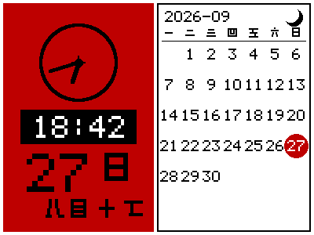
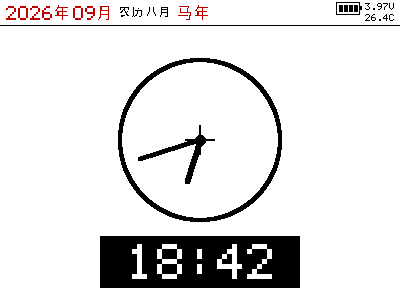

# ZK42V 价签（GR5513BEND）→ 自研固件 / 墨水屏基站

把一块 ZKONG ZK42V 电子价签（Goodix **GR5513BEND** + 4.2 寸 400×300 黑白红三色墨水屏）
从「只能用原厂基站」变成「我们自己能刷、能画、能自己推图」的板子。

这个文件夹是**留档与版本历史**：真正在跑的代码在本机的
`/Users/mac/Documents/Codex/2026-09-15/a/outputs/` 下，这边每改一版同步一次、提交一次，
就有记录可查。同步脚本就在本文件夹里：`tools/make-snapshot.py`。

---

## 现在到哪一步了

| 阶段 | 内容 | 状态 |
|---|---|---|
| **A** | 原厂固件全片备份（512KB）+ SHA-256 验真 | ✅ 完成 |
| **B0** | 写入路径验通（Goodix 自己的 FLM 算法，擦/写/读回） | ✅ 完成，`restore`/`verify` 全通过 |
| **B1** | 屏参数全部逆向（引脚 / 初始化序列 / 图像格式 / 刷新序列） | ✅ 完成 |
| **B1** | 自研固件：把屏点亮 + 画极性体检图 | ✅ 完成（黑/白/红 + 方向全对） |
| **B1.1** | AON 超深睡标志导致的重启循环 | ✅ 修掉，`boot_count` 不再涨 |
| **B2-B** | SWD 共享内存信箱推图（BLE 不灵时的后路） | ✅ 完成 |
| **B2-A** | 价签侧 BLE + 兼容 EPD-nRF5 协议的图片推送 | ✅ **2026-09-27 18:33 实测通**（网页 → BLE → 屏，整帧 0.9 秒） |
| **B2-A.2** | 日历 / 时钟页面（网页只发时间戳，页面由固件画） | ✅ build 26 |
| **B2-A.3** | 农历进日历页 + 画面选项（反色 / 旋转 180°） | ✅ build 28 |
| **B2-A.4** | **UI 方案 v1**（版式照样板逐像素量、字体全换成原厂/文泉驿、二十四节气） | ✅ **build 40** ← 见下面「里程碑」那一节 |
| **B3** | ESP32 基站（BLE 中枢：扫价签 → 连上 → 推时间/天气/城市名/纪念日/预警） | ✅ **build-24（2026-10-02）** 见下面「里程碑：基站 v1」 |
| **B3.1** | 天气链路：和风实况 + **实时预警**，走 NAS 上的局域中继（ESP32 做不了 TLS） | ✅ `wx-relay` + 固件 build 71/72（预警画在表头） |
| **B3.2** | 开机流程精简：5 次全刷 → 1 次；插电到屏上正确 ~90 秒 → ~26 秒 | ✅ 2026-10-02 |

安全网一直在：**任何**时候都能把出厂固件刷回去 ——

```bash
cd <本机项目>/outputs/pyocd
MODE=restore bash flash-write.sh     # 整片刷回出厂备份（128 颗扇区，约 3 分钟）
MODE=verify  bash flash-write.sh     # 按一下 RST 再跑，看到 VERIFY_OK 就回厂了
```

---

## 目录结构

```
zk42v-epd/
├── firmware/                  自研固件（GR5513 裸机 C，GCC 工具链）
│   ├── README.md              ← **固件手册**：完整命令、判据、B1 复盘、已知不确定项
│   ├── build.sh               一键：编译 + 打包成能过原厂 bootloader 校验的整片镜像
│   ├── zk42v-epd-app/
│   │   ├── GCC/Makefile               用 SDK 的编译参数，目标 zk42v_epd
│   │   ├── GCC/gcc_linker_zk42v.lds   APP 落 0x0100A000，栈顶 0x3001F000，留 4KB 调试块
│   │   └── Src/
│   │       ├── main.c                 主流程 + 接管 main_init（清超深睡标志、启动计数）
│   │       ├── board/zk42v_board.h    引脚表 / 屏参数（每个值都带出处）
│   │       ├── board/zk_dbg.h         0x3001F000 调试状态块的定义
│   │       ├── epd/epd_zk42v.[ch]     屏驱动（重放原厂初始化/刷新序列）
│   │       ├── img/testimg.[ch]       极性+方向体检图（四条横带 + 定位小条）
│   │       └── config/custom_config.h SDK 配置（GR5513BEND、APP 在 0x0100A000）
│   └── tools/
│       ├── fwpack.py          把 APP 打包成整片镜像（含自检，会拒绝不合规的镜像）
│       └── test_fwpack.py     打包器的离线自测（18 项）
├── host/pyocd/                上位机工具（pyOCD 用户脚本 + 包装脚本 + 离线测试台）
│   ├── led-window-user.py     核心：抢 SWD 窗口、读写 flash、体检（≈4100 行）
│   ├── flash-app.sh           MODE=app 写自研 APP / MODE=appverify 只读验收
│   ├── flash-write.sh         原厂那套：probe / pagetest / peek / restore / verify
│   ├── status.sh              体检自研固件（多次采样 + 复位检测 + AON 寄存器）
│   └── test-*.py              离线测试台（不需要硬件，8 个文件、100+ 项断言）
├── docs/
│   ├── PANEL-zk42v.md                   屏的逆向结果（每条结论都有代码地址）
│   ├── BACKUP-zk42v.md                  原厂固件备份与验真记录
│   ├── WRITE-zk42v.md                   写入路径（FLM 算法）四步走
│   ├── pyocd-notes.md                   硬件访问踩过的所有坑（SWD 假数据、XIP、复位线…）
│   ├── ZK42V-原厂固件串口日志与flash布局.md
│   ├── ZK42V-GR5513BEND-硬件判定与路线.md
│   └── runs/2026-09-27-b1/              B1 那轮实机跑出来的原始日志
└── analysis/
    ├── epd-seq.txt            从原厂固件里扫出来的屏总线序列
    └── tools/                 反汇编扫描脚本
```

---

## 为什么这些路径是 `/Users/mac/...`

真正跑起来的那一份在：

```
/Users/mac/Documents/Codex/2026-09-15/a/
├── GR551x-SDK/                 Goodix 官方 SDK（另一份 clone，不在本仓库）
├── tools/pyocd/pyocd           打包好的 pyOCD 0.45
└── outputs/
    ├── firmware/               自研固件（= 本仓库的 firmware/）
    ├── pyocd/                  上位机脚本（= 本仓库的 host/pyocd/）
    └── analysis/               逆向中间产物
```

`firmware/zk42v-epd-app/GCC/Makefile` 里的 `SDK_ROOT`、`led-window-user.py` 里的
`FLM_PATHS`、几个 `.sh` 里的 `ROOT`，都是按这个布局写死的。想在别的机器上跑，
改这几处路径（Makefile 里可以用 `make SDK_ROOT=/别的/路径` 覆盖）。

所以这个仓库文件夹的定位是：**留档 + 历史**，不是运行位置。

---

## 重新编译 / 烧录（在本机项目目录里跑）

```bash
cd /Users/mac/Documents/Codex/2026-09-15/a/outputs/firmware
bash build.sh                 # 编译 + 打包 → zk42v-custom-512k.bin（会打印 SHA-256）

cd ../pyocd
MODE=app bash flash-app.sh      # 只写 0x0100A000 那 19 颗扇区 + 更新 0x01002000 的镜像信息
MODE=appverify bash flash-app.sh
bash status.sh                  # 体检
```

离线测试（不用硬件，随时可跑）：

```bash
cd /Users/mac/Documents/Codex/2026-09-15/a/outputs/firmware && python3 tools/test_fwpack.py
cd ../pyocd && for t in test-*.py; do python3 "$t"; done
```

## 怎么更新这个文件夹（每次改完都这么做）

真正的代码在本机 `outputs/` 下改，改完把快照刷到这边、**本地提交**：

```bash
cd <本地仓库>/zk42v-epd
python3 tools/make-snapshot.py          # 从本机 outputs/ 覆盖式同步（--dry-run 可先看）
git add -A && git commit -m "说明这次改了什么"
```

**推送的节奏**：平时只本地提交攒着，**到一个里程碑再 `git push`**（省得每改一行就往
GitHub 推一次）。里程碑指的是：B1 点亮、B2 BLE 能推图、B3 基站能跑 这种阶段性的点。

`tools/make-snapshot.py` 里的 `FILES` 表就是「哪些文件算项目文件」的清单 ——
加新文件时在表里加一行。它**不会**动原厂固件备份和构建产物（见下节）。

当前这个文件夹在 **`zk42v-epd` 分支**上，远端是 `CyrusShu/GR551x-MicroPython`
（没有直接写进 `master`，这样 fork 的 `master` 还能干净地跟上游
`goodix-ble/GR551x-MicroPython` 同步）。想把合并进 `master`：

```bash
git checkout master && git merge zk42v-epd && git push
```

---

## 技术上真正关键的三件事（免得以后忘）

1. **原厂 bootloader 留着不动，只换 APP。** 它按 `0x01002000` 那条 40 字节镜像信息
   找 APP，校验方式是「APP 镜像逐字节求和取低 32 位」。这个公式是**反向验证过**的：
   拿出厂镜像按它算，bootloader 段得 `0x00173927`、APP 段得 `0x00CCE71B`，
   跟串口日志里原样打出来的两个数一字不差。
2. **屏是 SSD1680/1683 那一族**（用 EPD-nRF5 的命令表交叉验证过：`0x74`=ANALOG_BLOCK_CTRL、
   `0x7E`=DIGITAL_BLOCK_CTRL、`0x2B`=VCOM_CTRL）。引脚、初始化字节、缓冲区布局全部来自原厂固件。
3. **B1 的教训**：刷进去≠跑起来。那次的现象（写入 OK、一开始能连、几秒后调试口消失、屏不亮）
   指向平台 `soc_init()` 里的 `ultra_deep_sleep_wakeup_handle()` —— 它查 AON `SOFTWARE_1`
   低 16 位，等于 `0xF175` 就复位整个系统，而这个标志软复位不清，于是无限重启。
   详见 `firmware/README.md` 附录。

---

## 刻意没进库的东西

| 没进库 | 为什么 |
|---|---|
| `zk42v-factory-backup-run1.bin`（512KB 原厂固件） | 那是原厂的东西，不适合公开；需要就从本机 `outputs/pyocd/` 拿，SHA-256 记在 `docs/BACKUP-zk42v.md` |
| `zk42v-custom-512k.bin`（构建产物） | 跑一次 `firmware/build.sh` 就能重新生成，进库只会污染 diff |
| `app.asm` / `boot.asm`（2MB 反汇编） | 用固定命令就能从备份重新生成，命令记在 `docs/PANEL-zk42v.md` |
| `GR551x-SDK/` | 官方 SDK 另一个仓库，用相对引用就行 |
| `ble-base/.venv/`、`esp32/build/`、`*.bin`/`*.bak`/`*.progress` | 依赖与构建产物，`bash setup.sh` / `arduino-cli compile` 就能重建 |
| 和风私钥（`ed25519-private.pem` 等） | **凭据**，只留在本机和 NAS 上（`chmod 600`）；仓库里一个 `.pem` 都没有 |

---

## 🏁 里程碑：基站 v1（2026-10-02，tag `zk42v-base-v1`）

一天之内把"基站这一路"从能跑变成**能用**。这一天到底发生了什么（都留了实测日志）：

| 事 | 结果 |
|---|---|
| **和风天气上屏** | ESP32 做不了 TLS（实测 443 直连失败）→ 把和风搬到 NAS 上的 `wx-relay`（Docker），ESP32 只跟局域网说纯 HTTP |
| **天气预警**（用户："手机上有暴雨警报，价签只有小雨"） | 和风老接口 `/v7/warning/now` 已下架 → 新接口 `/weatheralert/v1/current/{纬度}/{经度}`；中继取回、基站经 BLE **0x7C** 下发，**表头那格"天气文字"改画预警名**（≥黄画红） |
| **开机刷屏 5 次 → 1 次** | 固件加"合并刷新窗口"（命令只预约 `now+2s`，连发的几条并成一次全刷）；基站"手里没数据先别连" |
| **插电到屏上正确：~90 秒 → ~26 秒** | 修掉"开机 60 秒内一次都不取数"、扫描窗口跑满、空连接；并加了**每步毫秒计时**（画像）把每一段摊开 |
| **修掉一个跨线程崩溃** | "扫到就 `stop()`" + 手动 `clearResults()` 让 BTC 线程和主线程同时改同一张 `std::map` → `StoreProhibited` → ESP32 自己重启、价签白刷一次 |
| **工程全部归档** | ESP32 基站（sketch + 自测 + 归档的 tweetnacl）、Mac 基站、pyocd 全套脚本与 201 份运行日志，都进了本仓库 |

**为什么这一天的方法值得记**：每次都不是"我觉得"，而是**先加计时/先解 backtrace/先读源码**，
再动手。三步都用上了：
· 耗时画像（每步毫秒）→ 找出"扫到即停"和"空连接"；
· ELF + addr2line 解 backtrace → 把崩溃定位到 `BLEDevice::gapEventHandler` 的 map 插入；
· 读 Arduino-ESP32 的 `BLEScan.cpp` → 确认插入无锁、`start(…, false)` 本来就清表。

---

## 🏁 里程碑：UI 方案 v1（build 40，2026-09-29）

日历页的**版式、字号、字体来源**在这一版定下来，作为 v1 基线（tag `zk42v-ui-v1`）。

**版式**（数值是拿样板照片**逐像素量**出来的，不是估的 —— 量测过程见
`analysis/qbsg-生态调研.md` 5.1~5.3 节）：

```
┌───────────────────────────────────────────────┐
│ 2026年09月  农历八月  马年  星期日   [电池] 3.97V │  白底；年月红、农历黑、生肖红、星期黑
│                                        26.4C  │
├───────────────────────────────────────────────┤
│  一   二   三   四   五  [六]  [日]           │  黑底白字，六/日 红底白字
├───────────────────────────────────────────────┤
│    1     2     3     4     5     6     7      │  日号：Helvetica Bold 9x13
│   廿一  廿二  廿三  廿四  廿五  廿六  廿七     │  农历：文泉驿点阵宋体 12pt（16x16、1px 笔画）
│   …（今天那格 = 红圆把日号和农历一起圈住）…    │  节气：原厂 wqy12（16x16、2px 笔画、红色）
└───────────────────────────────────────────────┘
```

| 部位 | 字体 | 规格 | 来源 |
|---|---|---|---|
| 日号 / 时间数字 | `u8g2_font_helvB14_tn` | Helvetica Bold 9×13 | **原厂固件自带**的 u8g2 字库 |
| 农历日名 | 文泉驿点阵宋体 12pt | 16×16、**1px 笔画** | `wenquanyi_12pt.bdf`（xfonts-wqy） |
| 节气 / 生肖 / 星期 / 表头 | `u8g2_font_wqy12_t_lunar` | 16×16、**2px 笔画** | **原厂固件自带**（跟样板同源） |
| 「农历」两个字 | 文泉驿点阵宋体 12pt + 左右加粗 1px | 16×16 | 同上（原厂子集里缺这两个字） |

**尺寸**：表头 26px、黑星期条 22px、格子 41~52px 行距（**按当月几行摊开**：5 行月 51、
6 行月 41、底部留 8px）、列宽 57px；今天红圆 r=23（行距≥46 时 25），
半径是算出来的 —— 农历两个字 33px 宽，最外角离圆心 `sqrt(16.5²+15²)≈22.3`。

**画面选项**（网页自带的「发送命令」框里敲十六进制，不用重刷固件）：

| 命令 | 效果 |
|---|---|
| `70 00` | 全关（默认） |
| `70 01` | 反色（黑白面取反，红面不动） |
| `70 02` | 旋转 180° |
| `70 04` | 日历页不画农历那一行 |
| `70 08` | 节气加粗（同样的字错开 1px 再画一遍） |
| `70 0C` | 位可叠：加粗 + 不画农历 |

预览图（跟屏上像素一致，宿主机编同一份 `zkgui.c` 渲染的）：

| 当月 | 样板同月（2025-08，含立秋/处暑） | 时钟页 | 节气加粗（`70 08`） |
|---|---|---|---|
|  |  |  |  |

镜像：`check_sum = 0x00C4B4D1`，SHA-256 `522f3269…26a6`，126408 字节（31 颗扇区，
离 bootloader 上限还有 25KB）。**离线自测 9 套全绿**（农历 19 个已知日期 / 节气 16 项 /
版式 21 项 / 打包器 / 图片转换 / 状态块布局 / 广播 AD / 反色旋转 / 毫秒时基）。

> 已知不做 v1 的两件事：① **开机不会自动进日历**（模式和时间只存在 RAM 里，每次上电是"图片模式"，
> 要手机点一次「日历模式」；断电后屏上画面留着但不再更新）；② 天气/温度里只有"片内温度"，
> 没有环境温度（没传感器）。

## 现在能干什么

网页端用 `tsl0922/EPD-nRF5` 那套（Web Bluetooth + 抖动 + RLE），连上 `ZK42V-EPD` 之后：

* **推图**：任意 400×300 三色图（0.9 秒发完一整帧，屏上 ~16 秒全刷）；
* **日历模式**：左红面板（表盘 + 数字时间 + 大日期 + 星期 + **农历**）、右白面板月历（今天红圈）；
* **时钟模式**：整屏大表盘（原厂说这模式就是用来除残影的，每分钟全刷）；
* **画面选项**：网页自带的「发送命令」框里敲十六进制 —— `7001` 反色、`7002` 旋转 180°、
  `7004` 日历页不画农历（位可叠，`7000` 全关）。

BLE 卡了很久的那一段（协议栈起来了、命令被接受、但控制器不回 `ADV_START`、空中没包）
最后是靠**扫描实验**定位的：4 秒听到 395 条广播、16 个设备 ⇒ 射频和收通路都是好的，
于是问题在发送侧；再 A/B 对照 6 套广播数据，确认病根是**广播数据里自己塞了 `Flags(0x01)`**
（协议栈会按 `disc_mode` 自己加，重复即判非法 `0x4A`）。全过程在 `firmware/README.md`。

## 接下来

* **功能清单**（借自社区上位机 `xly95` / `epdhub`）：哪些做了、哪些没做、各自的控制通道
  与风险，都在 **`firmware/docs/feature-backlog.md`**。优先级最高的两条待办是
  **局刷校准**（时钟模式每分钟 16 秒全刷太费）和**休眠时段**（定时白屏除残影）。
* **B3 基站**：✅ 已完成（ESP32 基站 build-24 + NAS 中继）。剩下的还没做的：
  - **局刷**（唯一还能大幅提速的地方：全刷 16 秒 → 1~2 秒）——见 backlog 第 5 条；
  - **基站重推判断**：基站自己重启时会把价签当成"刚上电"、重推一遍静态配置，
    要根治得让价签报一个"我是第几次开机 / 开机多久"的标记；
  - 多台价签 + 同一基站（用户说先放一边）。

> ⚠️ 加功能前先看镜像体积：原厂 bootloader 只收 **≤ 151488 字节**的 APP
> （超了会在 `0x01003720` 死循环，build 26 就是这么"刷完起不来"的）。
> `bash build.sh` 会硬检查这个上限。build 28 = 147748 字节，余 3740。
